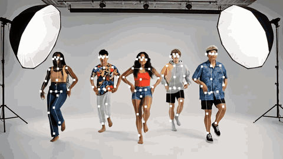
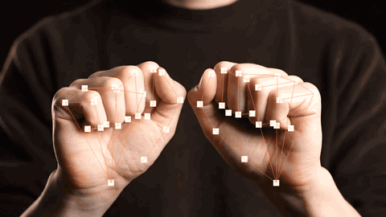
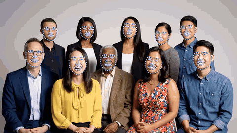
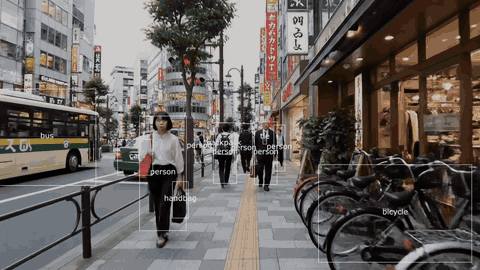
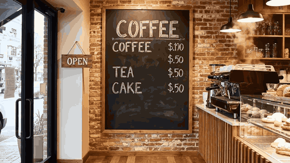
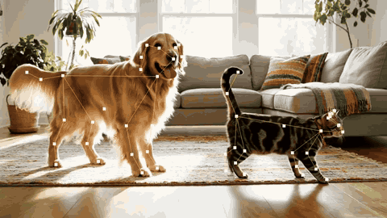
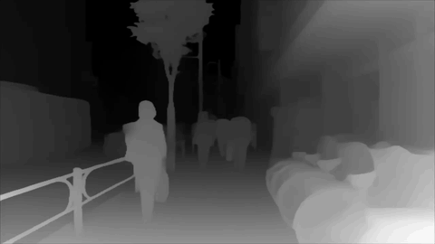
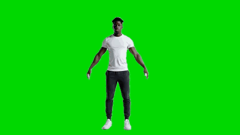
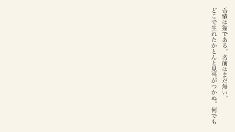
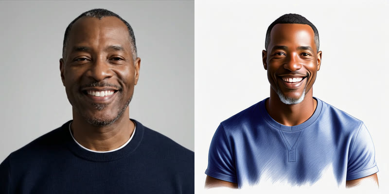

# Apple Frameworks for TouchDesigner

> Apple のオンデバイスフレームワークを TouchDesigner のネイティブOPに。

[English](README.md) | **日本語**

macOS / Apple Silicon の**オンデバイスML・メディアフレームワーク**(Vision / Core ML /
Core Image / VideoToolbox・MetalFX / SpeechAnalyzer / Sound Analysis / Natural Language /
FoundationModels / ScreenCaptureKit / RealityKit ほか)を、**TouchDesigner のカスタム
オペレータ**として直接使えるようにするプラグイン集です。

- **macOS 専用**。Neural Engine / GPU をそのまま使うので、外部ランタイム・Python 環境・
  クラウドAPI は不要(モデル同梱のものは追加ダウンロードも不要)
- 推論はワーカースレッドで非同期に走り、**cook をブロックしない**(TD 本体のfpsを保つ)
- **Windows+NVIDIA 専用の TD 標準OP の macOS 代替**を主眼にしたものは、チャンネル/
  テクスチャ形式を既存OPに極力合わせています

各プラグインの詳細(パラメータ・出力仕様・実測値・注意)は**サブフォルダの README** を参照。
`demo.toe` に**全OPの最小利用例**を1オペレータ1コンテナで配置しています。

## デモ

いずれも `demo.toe` を M2 MacBook Air で動かして収録したものです。ImagePlayground だけは
生成結果の静止画で、それ以外は 60fps で動いているところをそのまま撮っています。

書き出し先は `docs/demo/`。作り直すときは `./tools/make_demo_gifs.sh`
(元の収録ファイルはローカルのみでコミットしません)。

| | |
|:--:|:--:|
|  |  |
| **[Vision Pose](VisionPose/)** — 1人34キーポイント・同時5人 | **[Vision Hand](VisionHand/)** — 片手21関節 |
|  |  |
| **[Vision Face](VisionFace/)** — 1顔76ランドマーク・同時12顔 | **[CoreML](CoreMLDAT/)** — YOLOv3 で物体検出 |
|  |  |
| **[Vision Text](VisionText/)** — OCR・文字列ごとの矩形 | **[Vision AnimalPose](VisionAnimalPose/)** — 1匹25関節・犬と猫 |
|  |  |
| **[CoreML](CoreML/)** — Depth Anything V2 で単眼深度推定 | **[Vision Subject](VisionSubject/)** — グリーンバック無しの被写体切り抜き |
|  |  |
| **[CoreText](CoreText/)** — 日本語の縦組みを一文字ずつ表示 | **[ImagePlayground](ImagePlayground/)** — 顔写真(左)からイラスト(右)を生成 |

## 目次

- [デモ](#デモ)
- [Nvidia専用OPの macOS 代替として](#nvidia専用opの-macos-代替として)
- [プラグイン一覧](#プラグイン一覧)
- [使い方](#使い方)
- [バージョン](#バージョン)
- [必要環境](#必要環境)
- [プラグインを自作する人へ](#プラグインを自作する人へ)
- [ライセンス](#ライセンス)

## Nvidia専用OPの macOS 代替として

| やりたいこと | TD標準(Win+NVIDIA) | このリポジトリ |
|---|---|---|
| 人物ポーズ推定 | Body Track CHOP | [Vision Pose](VisionPose/) |
| 超解像アップスケール | Nvidia Upscaler TOP | [Metal Upscale](MetalUpscale/) |
| オプティカルフロー | Optical Flow TOP | [Vision Flow](VisionFlow/) |
| 顔トラッキング | Face Track CHOP | [Vision Face](VisionFace/) |

## プラグイン一覧

### 人物・顔・手のトラッキング

| プラグイン | 種類 | 内容 |
|---|---|---|
| [Vision Pose](VisionPose/) | CHOP | 多人数の2Dボディポーズ(34キーポイント)。**Body Track CHOP と互換のチャンネル形式**。5人60fps |
| [Vision Pose3D](VisionPose3D/) | CHOP | 単一人物の**3Dポーズ**(17関節・メートル単位+2D投影・身長推定)。約2fpsのじっくり系 |
| [Vision Hand](VisionHand/) | CHOP | 手指トラッキング(21関節×最大100手・左右判定) |
| [Vision Face](VisionFace/) | CHOP | 顔検出+bbox・roll/yaw/pitch・ランドマーク(最大76点)・顔写りスコア。**Face Track CHOP 代替** |

### 物体・シーンの認識・読み取り

| プラグイン | 種類 | 内容 |
|---|---|---|
| [CoreML](CoreMLDAT/) | DAT | **物体検出**。YOLO等のCore MLモデルで「何が・どこに」を label/confidence/bbox で出力 |
| [Vision Classify](VisionClassify/) | DAT | **画像分類**(追加モデル不要)。上位N件の identifier/confidence |
| [Vision AnimalPose](VisionAnimalPose/) | CHOP | 犬・猫の2D姿勢推定(25関節・複数匹) |
| [Vision Rect](VisionRect/) | CHOP | 矩形検出→bbox/投影四隅(Corner Pin 直結) |
| [Vision Barcode](VisionBarcode/) | DAT | QR・各種バーコード検出→payload / symbology / bbox / 四隅 |
| [Vision Text](VisionText/) | DAT | **OCR / テキスト認識**(多言語・読み順ソート・Accurate/Fast) |
| [Vision Document](VisionDocument/) | DAT | **文書構造の認識**(macOS 26+): 段落/表/行/セル/リスト。OCRでなくレイアウト構造 |
| [Vision Trajectory](VisionTrajectory/) | CHOP | 放物運動する小物体の軌跡検出(実測点/投影点/放物線係数) |
| [Vision Horizon](VisionHorizon/) | CHOP | 水平線・地平線の角度と補正transform |
| [ImageIO Metadata](ImageIOMetadata/) | DAT | 画像ファイルの EXIF/GPS/IPTC 読み取り(GPS十進度変換つき) |

### 切り抜き・マスク

| プラグイン | 種類 | 内容 |
|---|---|---|
| [Vision Subject](VisionSubject/) | TOP | **任意被写体の切り抜き**(写真アプリ「被写体をコピー」と同じAPI)。ソフトマスク/背景透過 |
| [CoreML SAM2](CoreMLSAM2/) | TOP | **点を指定して任意物体をマスク**(SAM 2.1)。観客が触れたものを切り抜く演出に |

### 追跡・モーション・カメラワーク

| プラグイン | 種類 | 内容 |
|---|---|---|
| [Vision Flow](VisionFlow/) | TOP | **オプティカルフロー**(動きベクトル場)。**Optical Flow TOP 代替**(UV/Pixels) |
| [Vision Saliency](VisionSaliency/) | TOP | 顕著性マップ+**オートフレーミング**(注目領域のクロップ矩形を Crop TOP 直結でカメラワーク自動化) |

### 映像加工・超解像

| プラグイン | 種類 | 内容 |
|---|---|---|
| [Metal Upscale](MetalUpscale/) | TOP | **リアルタイム超解像**。**Nvidia Upscaler TOP 代替**(MetalFX 2x / VT SuperRes 4x / VT LowLatency) |
| [Metal Denoise](MetalDenoise/) | TOP | ML テンポラルノイズ除去(対応ハードのみ。M2非対応) |
| [CoreImage RAW](CoreImageRAW/) | TOP | **DNG / ProRAW のリアルタイム現像**(露出/WB/ノイズ/シャープ)。CIRAWFilter |
| [CoreImage HDR](CoreImageHDR/) | TOP | HEICの**HDRゲインマップ抽出**＋SDR/HDR(EDR)変換 |
| [ImageIO File In](ImageIOFileIn/) | TOP | **任意の画像ファイルを表示(TDが開けないHEIF/HEICも)** → Color と、埋め込みの**深度/視差/Portrait Matte/セマンティックマット**。EXIFの向きを補正 |

### 汎用ML推論・画像生成

| プラグイン | 種類 | 内容 |
|---|---|---|
| [CoreML](CoreML/) | TOP | **任意の Core ML モデル**を差し替えて推論(深度推定・スタイル変換・分類等)。画像/配列出力を自動判別 |
| [CoreML](CoreMLCHOP/) | CHOP | 任意の Core ML モデルの**ベクトル出力**をCHへ(埋め込み・キーポイント等) |
| [CoreML ImageGen](CoreMLImageGen/) | TOP | **外部 Core ML モデルで text2img / img2img**(Stable Diffusion / SDXL / SD Turbo) |
| [ImagePlayground](ImagePlayground/) | TOP | **Apple Image Playground でテキスト→画像**(`ImageCreator`・macOS 15.4+)。外部モデル不要。Animation / Illustration / Sketch。人物は入力0に顔画像を接続 |
| [CoreImage Code](CoreImageCode/) | TOP | QR / Aztec / PDF417 / Code128 の**生成**(外部ライブラリ不要) |
| [CreateML](CreateML/) | DAT | **統合オンデバイストレーナ**。`Task`メニューで Image / Hand Pose / Action(体)/ Hand Action / Sound / Activity(CHOP時系列)/ Tabular分類・回帰 を切替→`.mlmodel`。出力は CoreML TOP / CoreML Motion CHOP / SoundClass 等が推論 |
| [CreateML Training Recorder](CreateMLTrainingRecorder/) | CHOP | **CHOP時系列 → CreateML学習用CSV**(recording / label / 特徴列)。VisionPose/Hand等をTD内で収録・ラベル付けし、CreateML(Activity)へ直結 |
| [CoreML Motion](CoreMLMotion/) | CHOP | 入力CHOP(VisionPose等)を予測窓ぶんバッファして**ライブでジェスチャ分類**(クラス別確率+confidence)。CreateMLのActivityタスクと対 |

### 音声・音響

| プラグイン | 種類 | 内容 |
|---|---|---|
| [Sound Class](SoundClass/) | CHOP | **音の分類**(拍手/歓声/警報音等 300種類+)。独自 Core ML 音響モデルも可 |
| [Sound Features](SoundFeatures/) | CHOP | 音響特徴(RMS/peak/centroid/onset/beat/BPM/16帯域) |
| [Speech Text](SpeechText/) | DAT | **ライブ文字起こし**。Apple SpeechAnalyzer(macOS26+)/ WhisperKit(macOS14+・多言語・英訳) |
| [Speech Synth](SpeechSynth/) | CHOP | オンデバイス**音声合成**→ PCM stereo |
| [Speech Activity](SpeechActivity/) | CHOP | **発話区間検出**(speaking/onset/offset)。文字起こしの開始・終了トリガーに |

### 言語・テキスト

| プラグイン | 種類 | 内容 |
|---|---|---|
| [LLM AFM](LLMAFM/) | DAT | **Apple Intelligence オンデバイスLLM**(macOS26+)。**構造化出力(JSONスキーマ)**+**ツール呼び出し**(LLMがツールを要求→TouchDesignerが実行して結果を返す)でショー制御へ直結 |
| [LLM MLX](LLMMLX/) | DAT | **Apple MLX によるローカルLLM**(mlx-swift-lm)。任意の mlx-community モデル(Gemma 4 / Qwen / Llama)を完全オンデバイスで実行しトークンをストリーミング。APIキー不要・モデルは初回にHFから自動DL |
| [Translate](Translate/) | DAT | **オンデバイス翻訳**。Speech Text 直結でリアルタイム字幕翻訳 |
| [Text Analyze](TextAnalyze/) | DAT | 感情スコア・言語判定・固有表現・意味的類似度(日本語対応)+**トークン(token / 品詞 / 見出し語)**と**埋め込みベクトル**(数値)。「発話の感情/話題でビジュアル制御」 |

### 3D・画面・入力デバイス・外部連携

| プラグイン | 種類 | 内容 |
|---|---|---|
| [RealityKit Capture](RealityKitCapture/) | SOP | **写真フォルダ→3Dメッシュ**(RealityKit Object Capture)。テクスチャ付きOBJ出力 |
| [ImageIO PointCloud](ImageIOPointCloud/) | SOP | **写真の深度→3Dポイントクラウド**(カメラ較正/画角で逆投影)。RGBから色サンプル |
| [Cinematic Video](Cinematic/) | TOP | **iPhone Cinematic動画**(macOS 26+): 深度(視差)マップ/**f値・ピント差し替え再レンダ**。メタデータ(フォーカス深度・被写体)は**Info CHOP**で出力 |
| [Vision Contours](VisionContours/) | SOP | 画像の輪郭を**閉じたLineジオメトリ**へ(Sweep/Extrude/Particle 直結) |
| [Screen Capture](ScreenCapture/) | TOP | ディスプレイ/**名前で選べる単一ウインドウ**の**画面収録**(最大120fps) |
| [CA Process Tap](CoreAudioProcessTap/) | CHOP | **指定アプリの音だけ**をタップ(Core Audio Process Tap・macOS 14.4+)or 全システム音→48kHz stereo。Screen Captureより粒度が細かい |
| [Spotlight](Spotlight/) | DAT | **OS全体のローカルファイル検索**(Spotlight / NSMetadataQuery)— 名前/内容/生kMDItem述語 |
| [Multipeer In / Out](MultipeerCHOP/) | CHOP | **iPhone/iPad をワイヤレスセンサーに**(ジャイロ/加速度/タッチを低遅延受信)。**iOSアプリ同梱** |
| [Multipeer In / Out](MultipeerDAT/) | DAT | Mac/iPhone 間の**ローカルP2Pテキスト**(自動接続・サーバー不要) |
| [Game Controller](GameController/) | CHOP | PS5/Xbox/MFi **ゲームパッド入力**(スティック/トリガー+モーション+ランブル) |
| [Shortcuts](Shortcuts/) | DAT | **macOSショートカット実行**(HomeKit照明・家電・通知を TD イベントから) |
| [AppleScript](AppleScript/) | DAT | **AppleScript / JavaScript(JXA)をTDから実行**(osascript)。他アプリ制御(Music/Finder等)・システム情報取得・自動化。**結果テキストも返る**。アプリ制御はAutomation権限が要る |
| [CoreText](CoreText/) | TOP | **Appleテキストレンダリング** — SF/可変ウェイト・カラー絵文字・日本語縦書き・グラデ/縁取り/シャドウ。標準Text TOPより自由で美しい文字 |
| [PDFKit](PDFKit/) | TOP | **PDFKit** — ページをテクスチャ描画。構造(メタ/アウトライン/テキスト/注釈)は**Info DAT**で出力 |
| [CoreWLAN](CoreWLAN/) | CHOP | **Wi-Fiの実測値**(CoreWLAN)— RSSI/ノイズ/SNR/送信レート/チャンネル |
| [CoreWLAN Scan](CoreWLANScan/) | CHOP | **周辺Wi-Fiをスキャン→チャンネル別の混雑度/AP数/最大RSSI**と最も空いてるch(2.4/5GHz)。**SSID名は同梱の位置情報許可ヘルパーappで取得可**(Info DAT) |
| [Network Discovery](NetworkDiscovery/) | DAT | **LAN上の全デバイスを発見**: Bonjour + **アクティブIPv4スキャン**(ARPスイープでBonjour非対応機器もMAC/ホスト名付き) → IP/MAC/**ベンダー(OUI)**/DNS名/mDNS名/**SMB名・ドメイン(NetBIOS)**/ポート/TXT(LanScan Pro相当) |

## 使い方

### 1. 導入(リリースビルドを落とすだけ・ビルド不要)

**[最新リリース](https://github.com/sygnalinc/Apple-Frameworks-for-TouchDesigner/releases/latest)**
から DMG をダウンロードしてください。Developer ID 署名 + **公証済み**なので、
ダウンロードしたマシンでも Gatekeeper の警告なしに開けます。

開いたら、**使いたい `.plugin` だけ**を
`~/Library/Application Support/Derivative/TouchDesigner099/Plugins/` へドラッグしてください。

> **まずは必要なものだけを推奨。** TouchDesigner は次の起動時に**プラグイン1つずつ
> 許可のダイアログ**を出します。59個すべてコピーすると、ネットワークに辿り着く前に
> 59回ダイアログを閉じることになります。あとから足せますし、許可はプラグインごとに
> 記憶されます。

まとめて入れる場合は:

```sh
cp -R "/Volumes/Apple Frameworks for TouchDesigner v0.9.2/"*.plugin \
      ~/Library/Application\ Support/Derivative/TouchDesigner099/Plugins/
```

そのあと **TouchDesigner を再起動**し、ダイアログで許可すると OP Create Dialog に現れます
(プラグインは起動時にしか走査されません。多数を追加・入れ替えた直後の初回起動は
再検証も走るため数分かかることがあります。2回目以降は通常速度です)。

### 2. 利用例を動かす

このリポジトリを clone して [`demo.toe`](demo.toe) を開いてください。`/project1` に
1オペレータ = 1コンテナで並んでいるので、**使いたいOPのコンテナを丸ごとコピー**するのが
出発点として最短です。利用例が使う映像素材は同梱してあるので、clone しただけで動きます。

モデルを使うプラグイン(CoreML / CoreML SAM2 / CoreML ImageGen / LLM MLX 等)は、モデルファイルを
`models/` に置いてください。**モデル本体はリポジトリに含まれません** —
[`models/README.md`](models/README.md) に、利用例が期待するファイル名と入手先の一覧・
ダウンロード手順があります。`demo.toe` の各利用例の note にも同じリンクを書いてあります。

### 3. ソースからビルドする場合(任意)

プラグインを改造したいとき、またはリリースビルドと SDK バージョンが異なる
TouchDesigner で動かしたいときだけ必要です。

```sh
cd VisionPose && ./build.sh      # → VisionPose/build/VisionPoseCHOP.plugin
```

前提: Xcode(`clang++`)と TouchDesigner.app(C++ SDK ヘッダを流用)。実行は TD 2023 系以降。
ビルドしたものを再起動せずに試すには、`C++ CHOP/TOP/DAT/SOP` を置いて
Plugin Path に `.plugin` を指定します。

### 4. AIコーディングエージェントと組む場合

[`.claude/skills/td-apple-ops/`](.claude/skills/td-apple-ops/) に、これらのOPを**使う側**の
スキルを置いてあります。導入手順、OPの選び方、非同期OP特有の配線ルール(cookを回す・
Info CHOP の読み方・`Flip`・`Aspect Correct UVs`)、uv をインスタンシングで映像に重ねる型、
症状別のトラブルシュート — いずれも利用例を組む過程で実際に踏んだものだけです。

Claude Code はこのリポジトリが文脈にあれば自動で読み込みます。他のプロジェクトからも
使いたい場合はシンボリックリンクを張ってください:

```sh
ln -s "$PWD/.claude/skills/td-apple-ops" ~/.claude/skills/td-apple-ops
```

使う側ではなく**作る側**のスキルは
[プラグインを自作する人へ](#プラグインを自作する人へ)を参照してください。

## バージョン

現在のリリース: **0.9.2**([`VERSION`](VERSION))

| バージョン | 日付 | OP数 | 主な内容 |
|---|---|---|---|
| **[0.9.2](https://github.com/sygnalinc/Apple-Frameworks-for-TouchDesigner/releases/tag/v0.9.2)** | 2026-08-08 | 59 | bypass から戻すと黒画像になる不具合を全17 TOP で修正、ビルド不能だった6件を修復。Vision Face のランドマーク並び、Vision AnimalPose の骨格接続。Vision Text に `Aspect Correct UVs` |
| [0.9.1](https://github.com/sygnalinc/Apple-Frameworks-for-TouchDesigner/releases/tag/v0.9.1) | 2026-08-08 | 66 | Vision系10opに `Aspect Correct UVs`。SDKバージョン不一致による起動時ロードエラーを修正 |
| [0.9.0](https://github.com/sygnalinc/Apple-Frameworks-for-TouchDesigner/releases/tag/v0.9.0) | 2026-08-07 | — | 最初の Developer ID 署名 + 公証リリース。DMGは取り下げ済み(0.9.2 を使ってください) |

| 層 | 値 | ルール |
|---|---|---|
| リポジトリ(gitタグ) | `v0.9.2` | op追加・機能追加で **minor**、修正で **patch**。`opType` のリネーム/削除は**破壊的変更**としてリリースノートに明記 |
| バンドル(`Info.plist`) | `CFBundleShortVersionString` = リポジトリ版 / `CFBundleVersion` = gitコミット数 | ビルド時に `common/version.sh` が自動で焼き込む |
| オペレータ(`customOPInfo`) | `majorVersion = 0` / `minorVersion = 9` | **opごと**。TDが `.toe` 保存値と比較する。後方互換でない変更(パラメータ削除・意味変更)をした**そのopだけ** `majorVersion` を +1 する |

**リリースビルド**は Developer ID(SYGNAL INC.)署名 + Hardened Runtime + timestamp +
**Apple公証(notarize)済み** — どのMacでもGatekeeper警告なしで開ける。ローカル開発ビルド
(`./build.sh`)は従来どおり ad-hoc 署名。リリース手順は
[`tools/release.sh`](tools/release.sh)(`sign` → `verify` → `dmg` → `notarize`)。

**0.x である理由**: このリポジトリでは opType がユーザーから見た公開APIであり、開発初期に
リネーム・統合・削除を何度も行った(そのたびに参照していた `.toe` が壊れる)。まだAPIを凍結していない。

**1.0.0 の条件**

1. op命名(`opType` / `opLabel`)の凍結
2. ハード/素材依存で未検証のopを実データで検証(Image Capture、CoreLocation Beacon、
   AudioToolbox Mix の4ch FOA など)
3. ~~**Developer ID 署名 + notarize** 済みの配布アーカイブを用意~~ — 完了(`tools/release.sh`)
4. 凍結後の名前で `demo.toe` の利用例が動作すること

## 必要環境

- macOS 12+(Apple Silicon 推奨)。一部の機能はより新しい macOS を要求(各 README に明記)
- ビルドに Xcode と TouchDesigner.app

### TouchDesigner Non-Commercial では検証が不十分です

開発・実測はすべて**ライセンス版**の TouchDesigner で行っています。無償の
**Non-Commercial** 版は[解像度が 1280x1280 に制限される](https://derivative.ca/download)ため、
それを超える出力をするオペレータは**制限による問題が出る可能性があります**(クランプ・
表示の破綻・失敗)。この状態での検証はできていません。特に該当しそうなもの:

| プラグイン | 理由 |
|---|---|
| [Metal Upscale](MetalUpscale/) | 2x / 4x の出力は必ず上限を超える(このOPの用途そのもの) |
| [Cinematic Video](Cinematic/) | 再レンダ出力が実測 3840x2160 |
| [ImageIO File In](ImageIOFileIn/) / [CoreImage RAW](CoreImageRAW/) / [CoreImage HDR](CoreImageHDR/) | 実機写真は通常 4000px 級(実測 3024x4032) |
| [Screen Capture](ScreenCapture/) | ネイティブ解像度のディスプレイ取り込み(実測 1710x1112) |
| [PDFKit](PDFKit/) | ページ描画が実測 1275x1650 |
| [CoreText](CoreText/) | 指定した出力解像度しだい |

回避策は出力解像度を下げることです。解像度を下げても直らない問題に当たった場合は
Issue を立ててください。Non-Commercial 版からの報告は歓迎します。

## プラグインを自作する人へ

共通のビルド・実装パターン(非同期ワーカー、TOP のダウンロード flip、Info CHOP 診断 など)と
実際に踏んだハマりどころは [`CLAUDE.md`](CLAUDE.md) にまとめてあります。エージェント向けに蒸留した
スキルが [`.claude/skills/td-apple-plugin/`](.claude/skills/td-apple-plugin/) にあります
(OPを**使う側**のスキルは [`td-apple-ops`](.claude/skills/td-apple-ops/))。
`common/build_plugin.sh` が bundle 組み立て・署名を共通化しています。

## ライセンス

本プロジェクトの自作コードは **[MIT ライセンス](LICENSE)** です。商用を含め自由に利用できます。

プラグインのコードはすべて自作で、Apple のソース・TouchDesigner SDK・モデルの
重みは同梱・再配布していません。Apple フレームワークは公開API経由で利用し(Apple の SDK
使用許諾に従いますが、あなたのコードのライセンスは制約されません)、TouchDesigner の C++ SDK は
各自のインストールから供給され、モデルは各自が固有ライセンスの下でダウンロードします。ビルド時
依存(`apple/ml-stable-diffusion` / `argmaxinc/WhisperKit`)はいずれも MIT で、SPM が取得する
だけで同梱していません。

第三者コンポーネントは**1つだけ同梱**しています。開発用の
[TouchDesigner MCP server](https://github.com/johnsabath/touchdesigner-mcp) COMP
(MIT・John Sabath 氏)で、`demo.toe` に `/project1/td_mcp_server` として含まれます。
プラグインの実装・検証を AI エージェントから行うためのツールで、どのプラグインにも不要です。
**ポート9988で全インターフェースに対し、認証なしで Python を実行できる口を開く**ため、
使わないときは `/project1/td_mcp_server` を削除してください。

詳細は [THIRD_PARTY_NOTICES.md](THIRD_PARTY_NOTICES.md) を参照。

### サンプル素材

`Assets/sample_*.mp4` のデモ映像は、本リポジトリ用に **Adobe Firefly(Google Veo 3.1 Fast)で
生成**したものです。したがって第三者の肖像権処理やロケ許可を必要としません。用途はオペレータの
動作確認(`demo.toe`)に限られ、リポジトリ本体と同じ MIT ライセンスで
配布します。登場する人物は合成であり実在の人物ではありません。Firefly の生成モデルはライセンス
済み・パブリックドメインのコンテンツで学習されており商用利用を想定していますが、これらの映像を
本プロジェクト外へ再配布する場合は、ご自身のプランに適用される Adobe の生成AI利用条件を確認してください。
