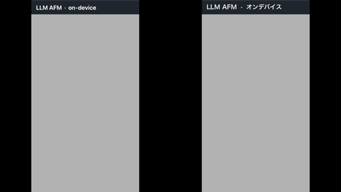

# Apple Frameworks for TouchDesigner

> Apple's on-device frameworks as native TouchDesigner operators.

**English** | [日本語](README.ja.md)

A collection of TouchDesigner custom operators (`.plugin`) that expose macOS /
Apple Silicon **on-device ML and media frameworks** — Vision, Core ML, Core Image,
VideoToolbox / MetalFX, SpeechAnalyzer, Sound Analysis, Natural Language,
FoundationModels, ScreenCaptureKit, RealityKit and more — directly inside TouchDesigner.

- **macOS only.** Runs on the Neural Engine / GPU as-is — no external runtime, no Python
  environment, no cloud API (bundled-model ops need no extra download either).
- **Never blocks cook.** Inference runs asynchronously on worker threads, so TouchDesigner
  keeps its frame rate.
- **A macOS alternative to Windows+NVIDIA-only stock OPs.** Where a plugin replaces a stock
  OP, its channel / texture format matches the original as closely as possible.

Each plugin has its own `README` with parameters, output specs, measured performance and
caveats. `demo.toe` contains a **minimal usage example for every OP**, one container each.

## Demos

All captured from `demo.toe` on an M2 MacBook Air — running live at 60 fps, except
ImagePlayground, which is a generated result.

Everything runs on-device. Where an external Core ML model is involved the caption names it
(Depth Anything V2, YOLOv3); the rest use Apple's own frameworks, and the LLM demo uses Apple
Intelligence's built-in on-device model (~3B). **The output is shown exactly as produced — no
retouching — so model mistakes are visible**; the LLM demo contains a wrong answer on purpose,
noted in its caption. A ~3B on-device model is good at short, general answers and unreliable on
specifics, so treat its text as a starting point rather than a source of truth.

The media lives in `docs/demo/`; regenerate it from the screen recordings with
`./tools/make_demo_gifs.sh` (the sources stay local and are not committed).

| | |
|:--:|:--:|
|  |  |
| **[Vision Pose](VisionPose/)** — 34 keypoints per person, 5 people at once | **[Vision Hand](VisionHand/)** — 21 joints per hand |
|  |  |
| **[Vision Face](VisionFace/)** — 85 landmarks per face, 10 faces at once | **[CoreML](CoreMLDAT/)** — object detection with YOLOv3 |
|  |  |
| **[Vision Text](VisionText/)** — OCR with per-string bounding boxes | **[Vision AnimalPose](VisionAnimalPose/)** — 25 joints per animal, dog and cat |
|  |  |
| **[CoreML](CoreML/)** — monocular depth with Depth Anything V2 | **[Vision Subject](VisionSubject/)** — subject cutout, no green screen |
|  |  |
| **[CoreText](CoreText/)** — vertical Japanese typesetting, revealed a character at a time | **[ImagePlayground](ImagePlayground/)** — a face photo (left) turned into an illustration (right) |
|  | |
| **[LLM AFM](LLMAFM/)** — Apple Intelligence's on-device model (~3B) answering in English and Japanese at once. Note the wrong answer: mixing red and blue gives *purple*, but the Japanese side says *blue* | |

## Table of contents

- [Demos](#demos)
- [As a macOS alternative to NVIDIA-only OPs](#as-a-macos-alternative-to-nvidia-only-ops)
- [Plugin catalog](#plugin-catalog)
- [Getting started](#getting-started)
- [Versioning](#versioning)
- [Requirements](#requirements)
- [Writing your own plugin](#writing-your-own-plugin)
- [License](#license)

## As a macOS alternative to NVIDIA-only OPs

| Goal | Stock OP (Win+NVIDIA) | This repo |
|---|---|---|
| Body pose estimation | Body Track CHOP | [Vision Pose](VisionPose/) |
| Super-resolution upscaling | Nvidia Upscaler TOP | [Metal Upscale](MetalUpscale/) |
| Optical flow | Optical Flow TOP | [Vision Flow](VisionFlow/) |
| Face tracking | Face Track CHOP | [Vision Face](VisionFace/) |

## Plugin catalog

### People, face & hand tracking

| Plugin | Family | What it does |
|---|---|---|
| [Vision Pose](VisionPose/) | CHOP | Multi-person 2D body pose (34 keypoints). **Channel format compatible with Body Track CHOP.** 5 people @ 60fps |
| [Vision Pose3D](VisionPose3D/) | CHOP | Single-person **3D pose** (17 joints in meters + 2D projection + height estimate). About 6–9 analyses per second |
| [Vision Hand](VisionHand/) | CHOP | Hand tracking (21 joints × up to 100 hands, left/right) |
| [Vision Face](VisionFace/) | CHOP | Face detection + bbox, roll/yaw/pitch, landmarks (up to 85), capture-quality score. **Face Track CHOP alternative** |

### Object & scene recognition

| Plugin | Family | What it does |
|---|---|---|
| [CoreML](CoreMLDAT/) | DAT | **Object detection.** YOLO-style Core ML models → label / confidence / bbox ("what & where") |
| [Vision Classify](VisionClassify/) | DAT | **Image classification** (no extra model). Top-N identifier / confidence |
| [Vision AnimalPose](VisionAnimalPose/) | CHOP | Dog / cat 2D pose (25 joints, multiple animals) |
| [Vision Rect](VisionRect/) | CHOP | Rectangle detection → bbox / projected corners (wire straight into Corner Pin) |
| [Vision Barcode](VisionBarcode/) | DAT | QR / various barcodes → payload / symbology / bbox / corners |
| [Vision Text](VisionText/) | DAT | **OCR / text recognition** (multilingual, reading-order sort, Accurate/Fast) |
| [Vision Document](VisionDocument/) | DAT | **Document structure** (macOS 26+): paragraphs / tables / rows / cells / lists, not just OCR |
| [Vision Trajectory](VisionTrajectory/) | CHOP | Trajectory of small projectile objects (measured / projected points, parabola coefficients) |
| [Vision Horizon](VisionHorizon/) | CHOP | Horizon angle + correction transform |
| [ImageIO Metadata](ImageIOMetadata/) | DAT | Read EXIF / GPS / IPTC from image files (GPS decimal-degree conversion) |

### Cutout & masking

| Plugin | Family | What it does |
|---|---|---|
| [Vision Subject](VisionSubject/) | TOP | **Cut out any subject** (same API as Photos' "Copy Subject"). Soft mask / transparent background |
| [CoreML SAM2](CoreMLSAM2/) | TOP | **Point-prompted segmentation of any object** (SAM 2.1). Cut out whatever the audience touches |

### Tracking, motion & camera work

| Plugin | Family | What it does |
|---|---|---|
| [Vision Flow](VisionFlow/) | TOP | **Optical flow** (motion vector field). **Optical Flow TOP alternative** (UV/Pixels) |
| [Vision Saliency](VisionSaliency/) | TOP | Saliency map + **auto-framing** (crop rect of the region of interest → Crop TOP for automatic camera work) |

### Image processing & super-resolution

| Plugin | Family | What it does |
|---|---|---|
| [Metal Upscale](MetalUpscale/) | TOP | **Real-time super-resolution.** **Nvidia Upscaler TOP alternative** (MetalFX 2x / VT SuperRes 4x / VT LowLatency) |
| [Metal Denoise](MetalDenoise/) | TOP | ML temporal noise reduction (supported hardware only; on M2 it warns and passes the input through) |
| [CoreImage RAW](CoreImageRAW/) | TOP | **Develop DNG / ProRAW** in real time (exposure / WB / noise / sharpness) via CIRAWFilter |
| [CoreImage HDR](CoreImageHDR/) | TOP | **HDR gain map** extraction + SDR/HDR (EDR) conversion from HEIC |
| [ImageIO File In](ImageIOFileIn/) | TOP | **Read any image file (incl. HEIF/HEIC that TD can't show)** → Color, plus embedded **depth / disparity / Portrait Matte / semantic mattes**. Applies EXIF orientation |

### General ML inference & image generation

| Plugin | Family | What it does |
|---|---|---|
| [CoreML](CoreML/) | TOP | Run **any Core ML model** by swapping it in (depth, style transfer, classification…). Auto-detects image / array output |
| [CoreML](CoreMLCHOP/) | CHOP | **Vector output** of any Core ML model into channels (embeddings, keypoints…) |
| [CoreML ImageGen](CoreMLImageGen/) | TOP | **text2img / img2img** with an **external Core ML model** (Stable Diffusion / SDXL / SD Turbo) |
| [ImagePlayground](ImagePlayground/) | TOP | **text→image via Apple Image Playground** (`ImageCreator`, macOS 15.4+). No external model; Animation / Illustration / Sketch. Wire a face image into input 0 to generate people |
| [CoreImage Code](CoreImageCode/) | TOP | **Generate** QR / Aztec / PDF417 / Code128 (no external library) |
| [CreateML](CreateML/) | DAT | **Unified on-device trainer** — one `Task` menu for Image / Hand Pose / Action (body) / Hand Action / Sound / Activity (CHOP series) / Tabular classifier & regressor → `.mlmodel`. Output models are read by CoreML TOP / CoreML Motion CHOP / SoundClass etc. |
| [CreateML Training Recorder](CreateMLTrainingRecorder/) | CHOP | **Record a CHOP time-series → CreateML dataset CSV** (recording / label / feature columns). Capture VisionPose/Hand takes in TD, label them, feed straight to CreateML (Activity) |
| [CoreML Motion](CoreMLMotion/) | CHOP | **Live gesture inference** — buffer an input CHOP (VisionPose etc.) over the prediction window and classify motion in real time (per-class prob + confidence). Pairs with CreateML's Activity task |

### Audio & sound

| Plugin | Family | What it does |
|---|---|---|
| [Sound Class](SoundClass/) | CHOP | **Sound classification** (applause / cheering / alarms… 300+ classes). Custom Core ML acoustic models too |
| [Sound Features](SoundFeatures/) | CHOP | Audio features (RMS / peak / centroid / onset / beat / BPM / 16 bands) |
| [Speech Text](SpeechText/) | DAT | **Live transcription.** Apple SpeechAnalyzer (macOS 26+) / WhisperKit (macOS 14+, multilingual, translate) |
| [Speech Synth](SpeechSynth/) | CHOP | On-device **speech synthesis** → PCM stereo |
| [Speech Activity](SpeechActivity/) | CHOP | **Voice activity detection** (speaking / onset / offset). Start/stop trigger for transcription |

### Language & text

| Plugin | Family | What it does |
|---|---|---|
| [LLM AFM](LLMAFM/) | DAT | **Apple Intelligence on-device LLM** (macOS 26+). **Structured output (JSON schema)** + **Tool Calling** (the LLM calls a tool, TouchDesigner executes it and returns the result) straight into show control |
| [LLM MLX](LLMMLX/) | DAT | **Local LLM via Apple MLX** (mlx-swift-lm). Runs any mlx-community model (Gemma 4 / Qwen / Llama) fully on-device with token streaming. No API key; model auto-downloads from Hugging Face on first use |
| [Translate](Translate/) | DAT | **On-device translation.** Wire to Speech Text for real-time subtitle translation |
| [Text Analyze](TextAnalyze/) | DAT | Sentiment / language ID / named entities / semantic similarity (JA supported) + **tokens (token / POS / lemma)** and **embedding vectors** (numeric). "Drive visuals from speech mood/topic" |

### 3D, screen, input devices & connectivity

| Plugin | Family | What it does |
|---|---|---|
| [RealityKit Capture](RealityKitCapture/) | SOP | **Photo folder → 3D mesh** (RealityKit Object Capture). Textured OBJ output |
| [ImageIO PointCloud](ImageIOPointCloud/) | SOP | **Photo depth → 3D point cloud** (unproject via camera calibration / FOV). Colors sampled from RGB |
| [Cinematic Video](Cinematic/) | TOP | **iPhone Cinematic video** (macOS 26+): depth (disparity) map or **re-render with adjustable focus / aperture**; metadata (focus depth, subjects) on its **Info CHOP** |
| [Vision Contours](VisionContours/) | SOP | Image contours → **closed Line geometry** (wire into Sweep / Extrude / Particle) |
| [Screen Capture](ScreenCapture/) | TOP | **Screen recording** of a display or **a single window picked by name from a dropdown** (up to 120fps) |
| [CA Process Tap](CoreAudioProcessTap/) | CHOP | **Tap a single app's audio** (Core Audio Process Tap, macOS 14.4+) or all system audio → 48kHz stereo. Finer-grained than Screen Capture |
| [Spotlight](Spotlight/) | DAT | **OS-wide local file search** (Spotlight / NSMetadataQuery) — name / content / raw kMDItem predicate |
| [Multipeer In / Out](MultipeerCHOP/) | CHOP | **Turn an iPhone/iPad into a wireless sensor** (low-latency gyro / accel / touch). **iOS app included** |
| [Multipeer In / Out](MultipeerDAT/) | DAT | **Local P2P text** between Mac / iPhone (auto-connect, no server) |
| [Game Controller](GameController/) | CHOP | PS5 / Xbox / MFi **gamepad input** (sticks / triggers + motion + rumble) |
| [Shortcuts](Shortcuts/) | DAT | **Run macOS Shortcuts** (HomeKit lights / appliances / notifications from TD events) |
| [AppleScript](AppleScript/) | DAT | **Run AppleScript / JavaScript (JXA) from TD** (osascript). Control other apps (Music/Finder/…), get system info, automate workflows — **returns the result text too**. App control needs Automation permission |
| [CoreText](CoreText/) | TOP | **Apple text rendering** — SF/variable-font weight, color emoji, Japanese vertical text, gradient / outline / shadow; freer & prettier than the stock Text TOP |
| [PDFKit](PDFKit/) | TOP | **PDFKit** — render a page to a texture; structure (metadata / outline / text / annotations) on its **Info DAT** |
| [CoreWLAN](CoreWLAN/) | CHOP | **Live Wi-Fi metrics** (CoreWLAN) — RSSI / noise / SNR / TX rate / channel |
| [CoreWLAN Scan](CoreWLANScan/) | CHOP | **Scan nearby Wi-Fi → per-channel congestion / AP count / max RSSI** and the least-congested channel (2.4/5GHz). Optional **SSID names via a bundled Location-authorized helper app** (Info DAT) |
| [Network Discovery](NetworkDiscovery/) | DAT | **Discover all LAN devices**: Bonjour services + **active IPv4 scan** (ARP sweep → MAC / hostname of every host, even non-Bonjour); merged IP / MAC / **vendor (OUI)** / DNS name / mDNS name / **SMB name & domain (NetBIOS)** / port / TXT (LanScan Pro-like) |

## Getting started

### 1. Install (download the release — no build needed)

Grab the DMG from the
**[latest release](https://github.com/sygnalinc/Apple-Frameworks-for-TouchDesigner/releases/latest)**.
It is signed with a Developer ID and **notarized**, so it opens without a Gatekeeper warning.

Open it and drag **only the `.plugin` bundles you actually need** into
`~/Library/Application Support/Derivative/TouchDesigner099/Plugins/`.

> **Start with a few.** TouchDesigner asks you to approve **each new plugin individually**
> on the next launch, so copying all 59 means dismissing 59 dialogs before you reach the
> network. You can always add more later — the approval is remembered per plugin.

If you do want everything:

```sh
cp -R "/Volumes/Apple Frameworks for TouchDesigner v0.9.4/"*.plugin \
      ~/Library/Application\ Support/Derivative/TouchDesigner099/Plugins/
```

Then **restart TouchDesigner** — approve the plugins when asked, and they appear in the OP
Create Dialog. (Plugins are only scanned at startup. Right after adding or replacing many
bundles the first launch also re-verifies them and can take a few minutes; the second is back
to normal.)

### 2. Try the examples

Clone this repository and open [`demo.toe`](demo.toe). `/project1` holds one container per
operator — copy the whole container of the one you want as a starting point. Every clip the
examples use is included, so it runs straight from a clone.

Model-based plugins (CoreML / CoreML SAM2 / CoreML ImageGen / LLM MLX…) need a model file
placed in `models/`. The models are **not** in this repository — [`models/README.md`](models/README.md)
lists every file the examples expect and where to download it. Each example in `demo.toe`
repeats the download link in its own note.

### 3. Build from source (optional)

Only needed to modify a plugin, or to run on a TouchDesigner whose SDK version differs from
the release build.

```sh
cd VisionPose && ./build.sh      # → VisionPose/build/VisionPoseCHOP.plugin
```

Requires Xcode (`clang++`) and TouchDesigner.app (its C++ SDK headers are reused). Runs on
TouchDesigner 2023 or later. To try a freshly built bundle without restarting, drop a
`C++ CHOP/TOP/DAT/SOP` and point its Plugin Path at the `.plugin`.

### 4. If you build with an AI coding agent

[`.claude/skills/td-apple-ops/`](.claude/skills/td-apple-ops/) is a skill for **using** these
operators: install steps, how to pick an OP, the wiring rules async operators need (drive the
cook, read the Info CHOP, `Flip`, `Aspect Correct UVs`), recipes such as overlaying keypoints
on video with instancing, and a symptom-by-symptom troubleshooting list. Everything in it was
actually hit while building the examples.

Claude Code loads it automatically when this repository is in context. To reach it from any
project:

```sh
ln -s "$PWD/.claude/skills/td-apple-ops" ~/.claude/skills/td-apple-ops
```

For *writing* plugins rather than using them, see
[Writing your own plugin](#writing-your-own-plugin) below.

## Versioning

Current release: **0.9.4** (see [`VERSION`](VERSION))

| Version | Date | Operators | Highlights |
|---|---|---|---|
| **[0.9.4](https://github.com/sygnalinc/Apple-Frameworks-for-TouchDesigner/releases/tag/v0.9.4)** | 2026-08-10 | 59 | **Vision Pose 3D reworked.** Frames are now fed as a sequence — detection 56–59/60 → 60/60 and the body-facing flip 16–18 % → 0–8 %. Analysis is ~2× faster. New `Coordinate Space` (root/camera), `Camera FOV`, `body:facing/pitch/roll`, `cam:distance/fov`; `bodyheight`, `heightestimation` and the old `camera:*` sextet removed (**breaking for that operator**). Metal Denoise now warns and passes through on unsupported hardware instead of erroring. Six plugins that silently failed to build since 07-23 are fixed. |
| [0.9.3](https://github.com/sygnalinc/Apple-Frameworks-for-TouchDesigner/releases/tag/v0.9.3)** | 2026-08-09 | 59 | Fixes garbled output under the Non-Commercial resolution cap (10 TOPs). **Vision Face landmarks 76 → 85** — the old layout truncated each region, so `p` indices shift (breaking for that operator). `Aspect Correct UVs` on Vision Contours. CoreText line-height fix. |
| [0.9.2](https://github.com/sygnalinc/Apple-Frameworks-for-TouchDesigner/releases/tag/v0.9.2) | 2026-08-08 | 59 | Fixes a TOP left black after bypass (all 17 CPUMem TOPs) and 6 plugins that had silently stopped building. Vision Face landmark order, Vision AnimalPose skeleton. `Aspect Correct UVs` on Vision Text. |
| [0.9.1](https://github.com/sygnalinc/Apple-Frameworks-for-TouchDesigner/releases/tag/v0.9.1) | 2026-08-08 | 66 | `Aspect Correct UVs` across 10 Vision operators. Fixes the startup load error caused by an SDK version mismatch. |
| [0.9.0](https://github.com/sygnalinc/Apple-Frameworks-for-TouchDesigner/releases/tag/v0.9.0) | 2026-08-07 | — | First Developer ID signed + notarized release. Its DMG was withdrawn; use 0.9.4. |

| Layer | Value | Rule |
|---|---|---|
| Repository (git tag) | `v0.9.4` | Adding operators / features bumps **minor**, fixes bump **patch**. Renaming or removing an `opType` is a **breaking** change and is called out in the release notes. |
| Bundle (`Info.plist`) | `CFBundleShortVersionString` = repo version, `CFBundleVersion` = git commit count | Stamped automatically by `common/version.sh` at build time. |
| Operator (`customOPInfo`) | `majorVersion = 0`, `minorVersion = 9` (Vision Face is `majorVersion = 1`) | **Per operator.** TouchDesigner compares these with the values saved in a `.toe`. Bump `majorVersion` **only** for that one operator when a change is not backwards compatible (parameter removed / semantics changed). |

**Release builds** are Developer ID signed (SYGNAL INC.), hardened-runtime, timestamped and
**notarized by Apple** — they open on any Mac without Gatekeeper warnings. Local development
builds (`./build.sh`) remain ad-hoc signed. The release pipeline is
[`tools/release.sh`](tools/release.sh) (`sign` → `verify` → `dmg` → `notarize`).

**Why 0.x:** operator names (`opType`) are the public API here, and several were renamed,
merged or removed during early development — each of which breaks `.toe` files that
referenced them. The API is not frozen yet.

**Road to 1.0.0**

1. Freeze operator naming (`opType` / `opLabel`)
2. Verify the remaining hardware / material dependent operators on real data
   (Image Capture, CoreLocation Beacon, AudioToolbox Mix with 4-ch FOA …)
3. ~~Ship a **Developer ID signed + notarized** release archive~~ — done (`tools/release.sh`)
4. Keep `demo.toe` usage examples working against the frozen names

## Requirements

- macOS 12+ (Apple Silicon recommended). Some features need a newer macOS — noted in each README.
- Xcode and TouchDesigner.app to build.

### Non-Commercial TouchDesigner is not well tested

The free **Non-Commercial** license
[caps resolution at 1280x1280](https://derivative.ca/download). Operators that would produce
something larger now **scale their output down to fit** and say so in a warning — verified by
reproducing the cap with `app.addNonCommercialLimit()`. Without that, TouchDesigner allocates the
clamped texture but still reads the plugin's larger buffer, and the image comes out sheared or
blank with no error. The operators that hit the cap:

| Plugin | Why |
|---|---|
| [Metal Upscale](MetalUpscale/) | 2x / 4x output always exceeds the cap — this is the whole point of the OP |
| [Cinematic Video](Cinematic/) | Re-rendered output measured at 3840x2160 |
| [ImageIO File In](ImageIOFileIn/) / [CoreImage RAW](CoreImageRAW/) / [CoreImage HDR](CoreImageHDR/) | Camera photos are routinely 4000px+ (measured 3024x4032) |
| [Screen Capture](ScreenCapture/) | Native display capture (measured 1710x1112) |
| [PDFKit](PDFKit/) | Page render (measured 1275x1650) |
| [CoreText](CoreText/) | Whatever output resolution you set |

If you need the full resolution, use a commercial license. If you hit something that scaling
down does not explain, please open an issue — Non-Commercial reports are welcome.

## Writing your own plugin

The shared build / implementation patterns (async worker, TOP download flip, Info CHOP
diagnostics, …) and every pitfall actually hit during development are collected in
[`CLAUDE.md`](CLAUDE.md), with a distilled agent skill under
[`.claude/skills/td-apple-plugin/`](.claude/skills/td-apple-plugin/)
(the counterpart for *using* the operators is
[`td-apple-ops`](.claude/skills/td-apple-ops/)).
`common/build_plugin.sh` factors out bundle assembly and signing.

## License

This project's own code is released under the **[MIT License](LICENSE)** — use it freely,
including commercially.

All of the plugin code is original: no Apple source, no TouchDesigner SDK, and no model
weights are redistributed here. Apple frameworks are used through their public APIs (governed
by Apple's SDK agreement, which does not restrict your code), the TouchDesigner C++ SDK is
supplied by your own install, and models are downloaded separately under their own licenses.
Build-time dependencies (`apple/ml-stable-diffusion`, `argmaxinc/WhisperKit`) are MIT and
fetched via SPM, not vendored.

One third-party component **is** bundled: the development-time
[TouchDesigner MCP server](https://github.com/johnsabath/touchdesigner-mcp) COMP (MIT, by
John Sabath), embedded in `demo.toe` as `/project1/td_mcp_server`. It is a tool for
driving TouchDesigner from an AI agent while building these plugins — no plugin needs it.
**It opens an unauthenticated Python-execution endpoint on port 9988, on all interfaces**;
delete `/project1/td_mcp_server` unless you are using it.

Details in [THIRD_PARTY_NOTICES.md](THIRD_PARTY_NOTICES.md).

### Sample media

The demo clips in `Assets/sample_*.mp4` were **generated with Adobe Firefly (Google Veo 3.1 Fast)**
for this repository, so they carry no third-party model release or location permit. They exist
purely to exercise the operators (`demo.toe`) and are covered by the
same MIT license as the rest of the repository. People appearing in them are synthetic and do
not depict real individuals. Firefly's generative models are trained on licensed and public
domain content and its output is intended for commercial use; if you redistribute these clips
outside this project, check Adobe's current generative AI terms for your own account tier.
